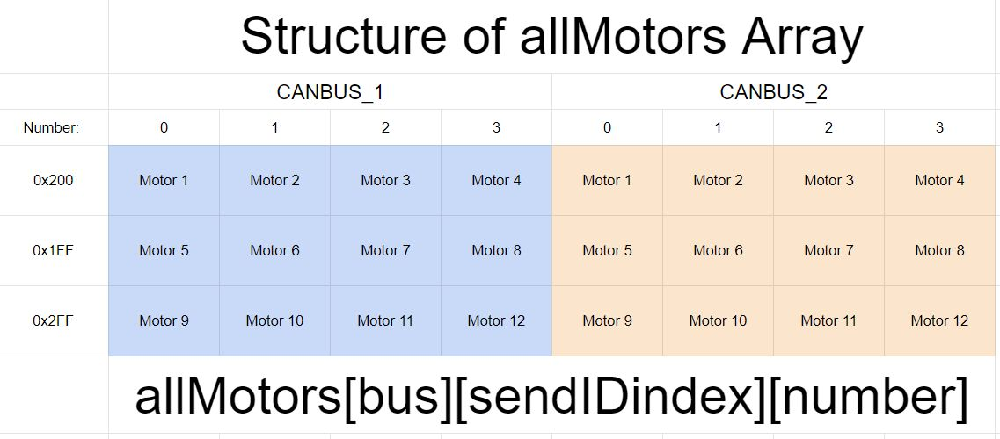

# DJIMotor Protocol

### DJIMotor-side

On the motor class side, we store all existing motors in a 3D Array, and it is organized as such:

The first index refers to which BUS the motor is in. The nucleo, the board we use, can support two CAN busses, and we use both of these busses in normal use. The second index is for the sendIDindex, as in, which ID are we sending to. 

The motors send to one of 3 adresses, depending on a motor's true ID. If you'll remember earlier, the true ID of a M3508 or M2006 is the same as its ID, but the true ID of a GM6020 is its normal ID + 4. A Motor with a true ID of 1-4 is sent its data to the adress `0x200`. 5-8 is sent in the ID `0x1FF`, and 9-11 (Motor 12 cannot exist) is sent in the ID `0x2FF`. From there, the third index refers to where in that message the motor lies. 

It works like this, say we have four motors, IDs 1-4, and they all have unique data. To make them move, we send all four of them data at the same time, through the adress 0x200. We send 8 bytes of data, and the data is paired up into 4 sets of two bytes, and each motor takes a pair as a 16 bit integer.

### Binary

To explain what a 16 bit integer is, we need to talk about bits, and binary.

When we talk about representing a number as binary, it means we're representing it in its purest form.

Binary works the same way that decimal (Our standard number system) works, but its base 2 instead of base 10. Lets do an example. Lets say we have the number 135. In decimal that is

| 10^3 | 10^2 | 10^1 | 10^0 |
| ---- | ---- | ---- | ---- |
| 0    | 1    | 3    | 5    |

Which equates to

$(0~\cdot~10^3)+(1\cdot10^2)+(2~\cdot10^1)+(5~\cdot10^0) = 125_{10}$

We can apply the same logic to a base that is 2, however now, we cannot have any digits above 1 (The same way we don't have any digits above 9 in base 10)

| 2^7 | 2^6 | 2^5 | 2^4 | 2^3 | 2^2 | 2^1 | 2^0 |
| --- | --- | --- | --- | --- | --- | --- | --- |
| 0   | 1   | 1   | 1   | 1   | 1   | 0   | 1   |

$(0~\cdot~2^7)+(1\cdot~2^6)+(1\cdot~2^5)+(1\cdot~2^4)+(1\cdot~2^3)+(1\cdot~2^2)+(0\cdot~2^1)+(1\cdot~2^0)= 125_{10}\\0)+(64)+(32)+(16)+(8)+(4)+(0)+(1)= 125_{10}$

As you can see, the math checks out, and `01111101` is the binary for 125

With 8 bits, the maximum number you can get is 255. However, that is only positive numbers. If we employ something called twos complement, where the last bit is instead negative, then we hit a range of -128 to 127. This is what is standardly used as an int8, or a signed byte.

Observe here, we have two bytes at the top, `0b00000100` and `0b10110000` (The `0b` defines the number as binary). From there, we get two unsigned int8s (uint8), which are 4 and 176. If we instead use the entire 16 bits as its own integer, we get one large integer, 1200, an int16.

### Motor-specific

Now, one of these int16s will tell a motor what power to go at, as a number from -16384 to 16383. This is defined by the motor's procotol. In one full frame however, we have the aforementioned 8 bytes, paired up into 4 int16s, controlling four motors at a time, all sent to one adress.

Below is the representation of the data in one frame of data

In this frame, we are telling Motor 1 to give it 1301 power, Motor 2 to give -5012, Motor 3 to give 570, and Motor 4 to give -10000. One more thing to keep in mind is that from stop, a motor will generally need about 1k to overcome static friction and begin moving, and after which that value can be lowered as it only needs to maintain movement, not begin it.
