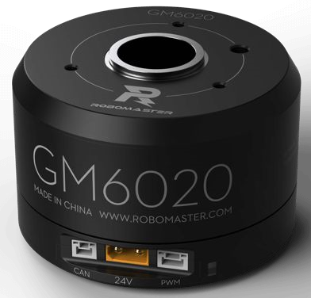
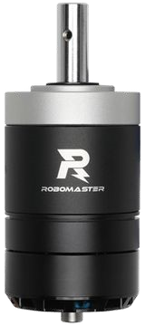
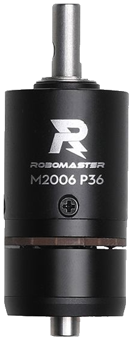
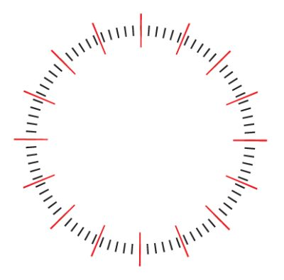
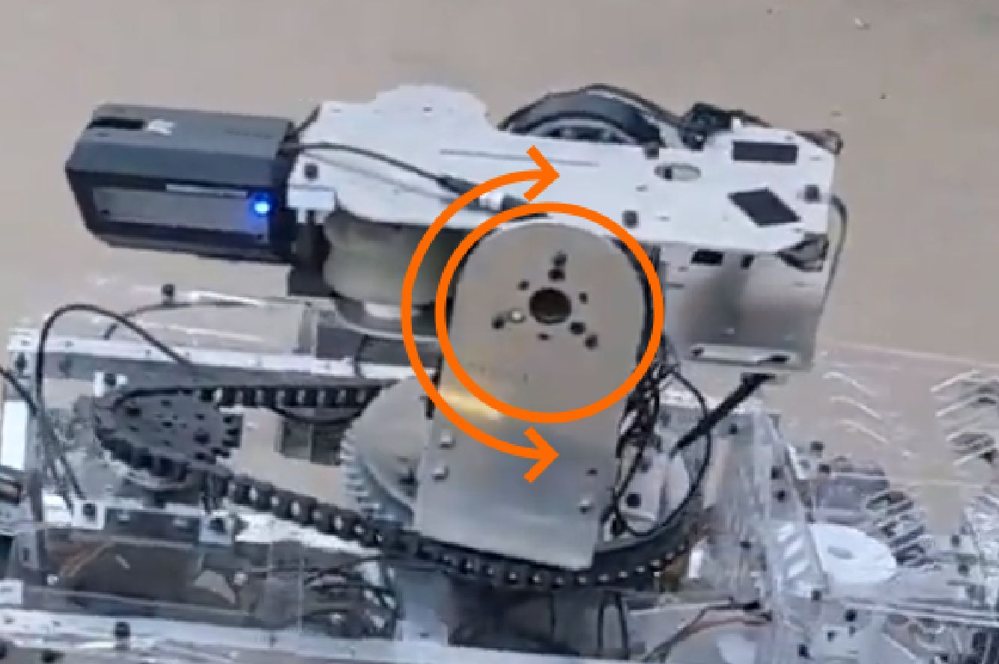

# Motors

There are about three types of DJI Motors we use:

They program slightly differently, which is why it’s necessary for the code to
know which motor on which port is which type.

| GM6020                 | M3508                                     | M2006                                     |
| ---------------------- | ----------------------------------------- | ----------------------------------------- |
|  |  |  |

## Constructor

`DJIMotor(short canID, NewCANHandler:CANBus bus, motorType mType)`

In this constructor, the canID is the actual ID of the motor. There can be up to 8 motors attached to one CAN bus, so the ID is a number from 1 tp 8.

The DJIMotor class supports assigning motors to either bus, so we can have a motor on `CANBUS_1` or `CANBUS_2`. For this, we use enums.

The motor type is also an input in the constructor, as the DJIMotor treats motors differently depending on what type of motor they are. The important enum names to know are `M3508`, `M2006`, and `GM6020`.

#### Motor IDs

One thing to note with motor IDs is that there is an unusual style of overlap between the M3508, M2006, and GM6020 IDs. M2006s and M3508s act the same, but GM6020's act as M3508s shifted forwards by 4.

| True ID | 1   | 2   | 3   | 4   | 5   | 6   | 7   | 8   | 9   | 10  | 11  | 12  |
| ------- | --- | --- | --- | --- | --- | --- | --- | --- | --- | --- | --- | --- |
| M3508   | 1   | 2   | 3   | 4   | 5   | 6   | 7   | 8   | DNE | DNE | DNE | DNE |
| M2006   | 1   | 2   | 3   | 4   | 5   | 6   | 7   | 8   | DNE | DNE | DNE | DNE |
| GM6020  | DNE | DNE | DNE | DNE | 1   | 2   | 3   | 4   | 5   | 6   | 7   | DNE |

For example, you could have an M3508 on ID 2, an M2006 on ID 7, but then the M2006 on ID 7 would prevent you from having a GM6020 on ID 3. In the underlying structure, we would assign them data the same and they give us feedback the same. This is something you need to consider when you wire robots and set their IDs. One final thing to keep in mind is that the GM6020's range from 1-7, so the total theoretical max motors per bus

#### Setting IDs for Motors

When you set the ID for a M3508 or M2006, you push the button on the ESC once, then tap it the number of the id you want to set it as, and then after a second it will set the ID. 
<insert video>
For example, if we were to set one to ID 3, we would go
TAP--TAP-TAP-TAP-------
and that would set it to ID 3.

For the GM6020s, there are 4 binary switches, three of which you flip in a way to set it as a binary number. The three switches will give you a range from 0-7, where valid combinations are 1-7. 

## Feedback

You can get four types of feedback from any of the CAN motors. We can assume we have a motor named `chassis1`.

`chassis1.getData(ANGLE)` Returns the angle of the motor, in ticks.

`chassis1.getData(VELOCITY)` Returns the velocity of the motor in RPM.

`chassis1.getData(TORQUE)` Returns the torque current of the motor.

`chassis1.getData(TEMPERATURE)` Returns the temperature of the motor in Celsius.

Our CANMotor class actually adds two more types of data that are not built into the motor, but that we’ve built into the class for ease of use.

`chassis1.getData(MULTITURNANGLE)` Returns the total angle of the motor, in ticks. If we use ANGLE, it only returns a value from 0 - 8196, and rolls over when it reaches either bound, but `MULTITURNANGLE` returns the angle without rollover.

`chassis1.getData(POWEROUT)` Returns the power being sent to the motor, regardless of what movement mode the motor is in.

You can zero the multiturn with `chassis1.zeroPos()`

#### A note on ticks

Ticks are the main method of measuring angle and position, however they behave differently on M3508s and M2006s than on GM6020s. On a GM6020, it behaves as you would expect, where each rotation of the output shaft is equivalent to 8196 ticks.

However, on an M3508 or an M2006, 8196 ticks is equal to one rotation of the internal motor, and that goes through a gearbox, which is 1:19 for a M3508 and 1:36 for an M2006. This means that 8196 ticks is actually 1/19 of a rotation or 1/36 of a rotation, respectively.

## Making it Move

#### Power

Making a motor move can be done one of three ways. These all work on all three types of motors. We can assume again we have a motor named `chassis1`.

`chassis1.setPower(int power)` gives the motor a raw current to run with. The motor is not responding to any stimulus regarding its own speed, position, or torque, it just runs. The range of input is -16384 to 16384, and this corresponds to a range of -20A to 20A.

For an M3508, the current you give directly corresponds to a torque, which means that giving the motor a power just determined the acceleration it takes to get to the top speed.

For a GM6020, the current seems to correspond to a speed, but with a load this changes.

#### Speed

The second way is to give it a speed. We can assume we have a motor named chassis1.

`chassis1.setSpeed(int speed)` has the motor run at a speed. This runs the output through a PID, and the CANMotor class is using the motor’s encoder values to regulate it’s speed. This is in RPM.

For this specific case, the desired would be whatever speed you set, which remains as the desired speed value until another value is set. The actual of the PID is the velocity matter we get from the motor, which is in RPM.

For setSpeed to work correctly, the motor’s speed PID needs to be tuned specifically, as the same PID will change based on the load of the motor. A motor on the wheel is going to behave differently than the motor controlling the pitch of the turret.

#### Position

Our final option is to give the motor a position. We can assume the motor named `chassis1`.

`chassis1.setPosition(int position)` has the motor run to and stay at a specific position. This runs through a separate PID, and in this movement mode, the CANMotor class is also regulating using the motor’s encoder values. The position is in ticks, where 8196 ticks is in one rotation.

The PID for the motor also needs to be tuned per-motor for setPosition to work correctly.

## CANHandler

The CANHandler is what handles all the underlying low level communications between the motor and our controller. The CANHandler handles the recieving and sending of the 8-byte messages sent to and from the DJI Motors.

In this separate document, we go more into depth on the CANHandler and our protocol: [DJIMotor Protocol In Depth](DJIMotorProtocolInDepth.md)
